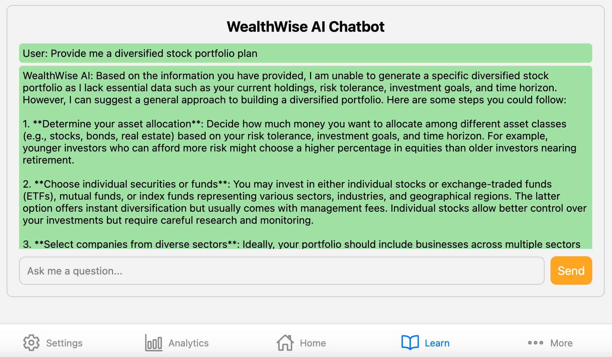

# 🐚 Shell Hacks 2024
# 💲 WealthWise AI

<div style="display: flex; justify-content: space-around;">
  
  
  
</div>

## 🗒️ Table of Contents

- 🤖 [Introduction](#introduction)
- 🤝 [Team](#team)
- ⚙️ [Tech Stack](#tech-stack)
- 🛠️ [Features](#features)
- 🏃‍♂️ [Quick Start](#quick-start)

## 🤖 Introduction <a name="introduction"></a>
This mobile application leverages AI through the OpenAI API and Yahoo Finance API to deliver a personal financial advisor via an AI chatbot, helping clients manage their finances effectively. Additionally, it features a pie chart visualization for tracking monthly budgets based on user expenses and income, along with educational resources to enhance financial literacy.

## 🤝 Team <a name="team"></a>
- [Thomas Baratta](https://www.linkedin.com/in/thomas-baratta-228244290/) (Backend)
- [Jordan Robertson](https://www.linkedin.com/in/jordan-ty-robertson/) (Fullstack)
- [Allison Brown](https://www.linkedin.com/in/allison-brown-16a8b6293/) (Frontend)
- [Deividas Ilgunas](https://www.linkedin.com/in/dilgunas2003/) (Backend)

## ⚙️ Tech Stack <a name="tech-stack"></a>

- JavaScript
- TypeScript
- React Native
- Expo
- Node.js
- Express.js
- React.js
- Sqlite
  
  
## 🛠️ Features <a name="features"></a>

- **Modern User Interface:** Fully functional and interactive user interface.
- **AI Chatbot:** Leverages AI to provide personalized advice through an interactive chatbox.
- **Budget Visualization:** Integrates a pie chart and line graph that visually represents a users' monthly budget.
- **Expense Tracking:** Automatically tracks expenses and income to provide better financial management.

## 🏃‍♂️ Quick Start <a name="quick-start"></a>

### Prerequisites <a name="prerequisites"></a>

Before you begin, make sure to install the following:

- [Git](https://git-scm.com/)
- [Node.js](https://nodejs.org/en)
- [npm](https://www.npmjs.com/) (Node Package Manager)

### Installation <a name="installation"></a>

1. Clone the repository:

    ```bash
    git clone https://github.com/tbaratta/WealthWise_AI.git
    ```

2. Navigate to the project directory:

    ```bash
    cd WealthWise_AI
    ```

3. Install project dependecies using npm:
   ```bash
    npm install
    ```

4. Create a new file named .env in the root of your project and add the following:
   ```bash
    API_KEY=
    ```
   Visit [Rapid API Website](https://rapidapi.com/rphrp1985/api/yahoo-finance160) to replace the placeholder value with a new api key.
   
5. Load the emulator:
   ```bash
    npx expo start
     i - ios
     a - android
     w - web
    ```
   
